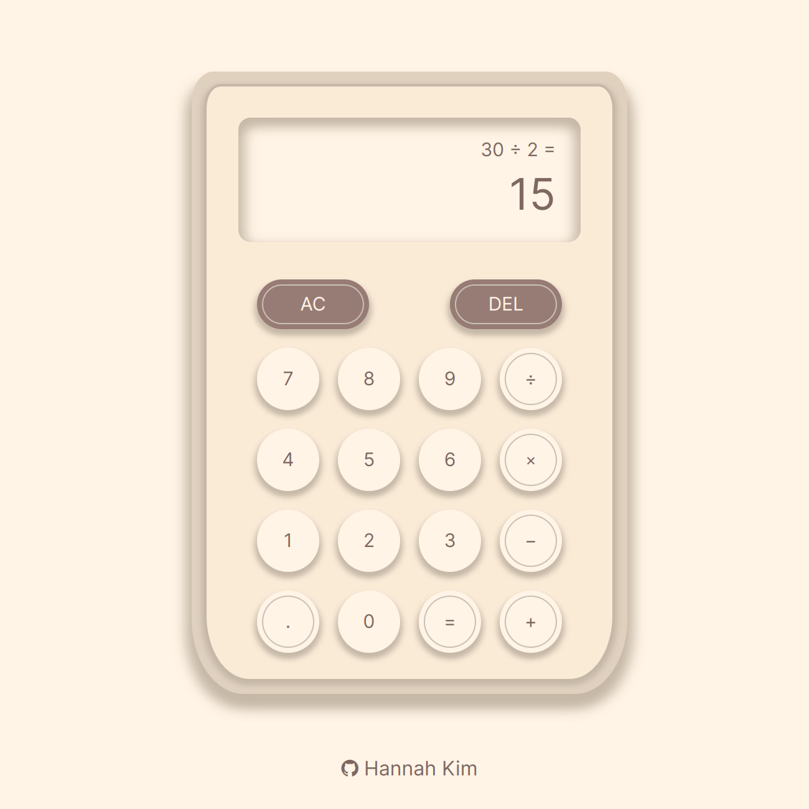

# Calculator

https://hannahkim313.github.io/calculator/

## Project Summary

This project exercise, created by The Odin Project, is a browser version of a
calculator. Some of the key functions implemented into this calculator are as
as follows:

* The add, subtract, multiply, and divide operators
* A "clear" button that erases all of the data inputted into the calculator
* A "delete" button that erases the last input
* A decimal button that only allows the user to input 1 decimal point

## In Action

## Goals

For this project, I plan to create a simple yet UI-friendly calculator while
implementing logic in the most concise way possible. Whether it's using more
arrow functions, ternary operators, or built-in methods, I want to gain a
better understanding of these practices and improve the readability of my code.

## Credits

The design of my calculator is inspired by the following sources:

* [Calculator 1](https://dribbble.com/shots/10780575-Calculator-and-neomorphism) by Siqi Wu from [Dribble](https://dribbble.com/)
* [Calculator 2](https://www.dhgate.com/product/calculator-goddess-cute-mini-large-screen/720775085.html) from [DHgate](https://www.dhgate.com/?dspm=pcen.pd.logo.1.reT9DEPFAsKlvsxhz30O&resource_id=)